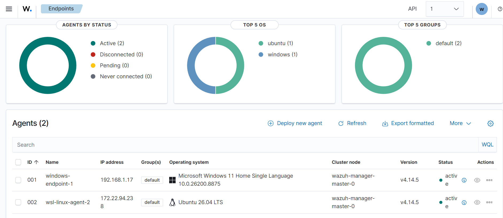
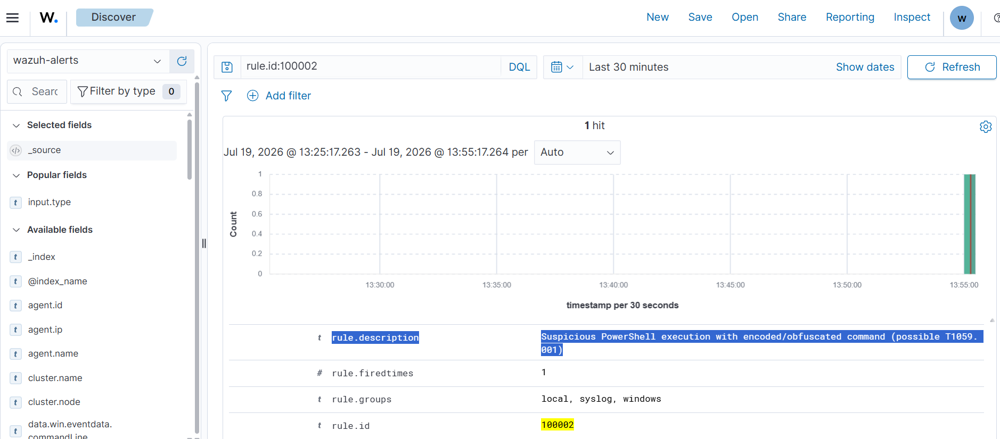
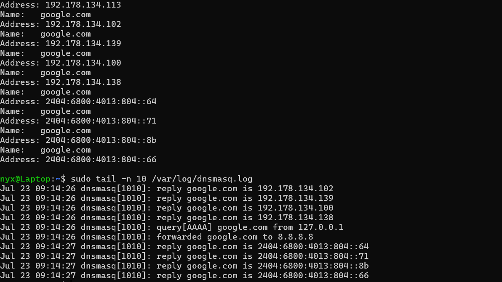
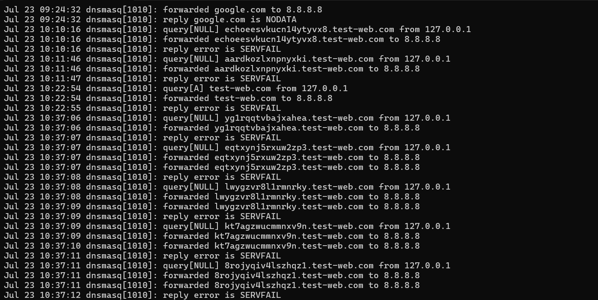

# Wazuh SIEM Detection Lab

A hands-on SOC analyst portfolio project: deploying Wazuh, connecting multi-OS log sources, and building custom MITRE ATT&CK-mapped detection rules including full debugging and design-reasoning notes for each step.

## Overview

This lab was built to close a specific resume gap: hands-on SIEM experience. Rather than following a scripted tutorial, the goal was to deploy Wazuh against real infrastructure constraints, connect real log sources, trigger real attack behavior, and write and debug custom detection logics from scratch.

**Environment:**
- Wazuh Cloud (managed manager/indexer/dashboard, free trial)
- Agent 1: Windows 11 laptop (native Wazuh agent)
- Agent 2: WSL2 Ubuntu instance (Wazuh agent)

## Architecture / Log Sources

| Source | Role | What it feeds |
|---|---|---|
| `windows-endpoint-01` | Windows 11 native agent | Event ID 4625 (logon failure), Event ID 4688 (process creation, with command-line auditing enabled) |
| `wsl-linux-agent-002` | WSL2 Ubuntu agent | `/var/log/auth.log`, `/var/log/syslog`, later `/var/log/dnsmasq.log` |

Both agents were verified end-to-end: agent connection status, then actual indexed event flow (not just "Active" status), confirmed via Discover/event search before building anything on top.



## Rule 1: Brute-Force Detection (Default Rule)

- **Rule ID:** 60122 — "Logon Failure - Unknown user or bad password"
- **Trigger:** Repeated Windows Event ID 4625 (failed logon)
- **Result:** Confirmed individual failed-logon events correctly detected and indexed. A full brute-force *correlation* alert (bundling multiple failures into one alert) was attempted but not achieved locally, because Windows 11's built-in account lockout protection forces a restart after 4-5 rapid failed attempts — a legitimate OS-level control that limited how much volume/speed could be generated safely in a local test. This is a real, explainable limitation of testing brute-force detection on a personal, non-domain-joined machine, not a flaw in the pipeline: individual-event detection (rule 60122) was verified working on genuine 4625 data.

## Rule 2: Custom Rule — Suspicious PowerShell Execution (T1059.001)

**Rule ID:** 100002 | **MITRE ATT&CK:** T1059.001 (Command and Scripting Interpreter: PowerShell)

```xml
<group name="local,syslog,windows,">
  <rule id="100002" level="12">
    <if_group>windows</if_group>
    <field name="win.system.eventID">^4688$</field>
    <field name="win.eventdata.newProcessName" type="pcre2">(?i)powershell\.exe</field>
    <field name="win.eventdata.commandLine" type="pcre2">(?i)(-enc|-EncodedCommand)</field>
    <description>Suspicious PowerShell execution with encoded/obfuscated command (possible T1059.001)</description>
    <mitre>
      <id>T1059.001</id>
    </mitre>
  </rule>
</group>
```

**Why this pattern:** Attackers commonly use PowerShell's `-EncodedCommand` flag to pass Base64-encoded scripts, evading plaintext keyword scanning. Legitimate use exists (e.g., automation scripts avoiding shell-quoting issues) but is rare,most normal PowerShell usage doesn't need it. Given the low base rate of legitimate use and the outsized cost of missing a real encoded payload, this is a reasonable-cost triage signal, not a block-on-sight rule: a false positive costs a few minutes of analyst review; a false negative could mean missed malware execution.

**Prerequisite work:** Windows does not log process creation (Event ID 4688) by default, and even with that enabled, does not include command-line arguments by default. Both had to be explicitly enabled, `auditpol` for process creation auditing, and a registry key (`ProcessCreationIncludeCmdLine_Enabled`) for command-line capture (Group Policy Editor is unavailable on Windows Home edition, so this was set directly in the registry).

**Debugging story:** The rule initially did not fire despite the underlying 4688 event being logged correctly. Diagnosed by inspecting the raw JSON of a similar event that *did* fire (a generic Wazuh rule, 67027), and found the rule was written using `win.eventdata.image`, a field that doesn't exist in this decoder's structure. The correct field is `win.eventdata.newProcessName`. Corrected the field path, retested, rule fired correctly.



**Known limitation:** The current regex checks for `-enc` and `-EncodedCommand` explicitly, but PowerShell accepts any unambiguous prefix of a flag name (e.g., `-en`, `-e`). A more complete rule would account for this; scoped out here as a documented gap rather than an unverified fix.

## Rule 3: DNS Tunneling Detection (Designed, Not Deployed) — T1071.004

**MITRE ATT&CK:** T1071.004 (Application Layer Protocol: DNS)

**Detection logic (validated via prior hands-on Wireshark analysis of real iodine DNS tunneling traffic):** alert only when three conditions co-occur (1) NULL DNS record type dominance, (2) single-domain persistence with no domain diversity, (3) high-entropy subdomain strings. Individually, none of these reliably separates tunneling from normal browsing (query volume/rate specifically was tested and ruled out as a standalone differentiator); the combination is the signal.

**Log source gap discovered:** Windows does not log DNS client queries by default. Enabling the DNS-Client Operational log (Applications and Services Logs → Microsoft → Windows → DNS-Client → Operational) captures the queried domain name, but **not record type**,a hard gap against condition (1). Sysmon Event ID 22 (DNSEvent) has the identical limitation.

**Workaround:** Installed `dnsmasq` on the WSL2 Ubuntu agent as a dedicated, non-default local resolver (queried explicitly via `nslookup <domain> 127.0.0.1`, never set as the system's default DNS, to avoid touching normal machine networking). Configured to log queries (`log-queries`) to a dedicated file (`log-facility=/var/log/dnsmasq.log`) rather than mixing into system `syslog`.

**Real issues debugged getting dnsmasq running:**
1. **Port conflict:** dnsmasq failed to bind port 53 — `systemd-resolved` already held it across multiple local addresses. Resolved by confirming sockets are unique per (address, port) pair, and binding dnsmasq explicitly to a free address (`listen-address=127.0.0.1`).
2. **Binding still failed:** `listen-address` alone wasn't sufficient, dnsmasq's default binding behavior still attempted broader interface binding. Added `bind-interfaces` to force strict single-address binding.
3. **Queries returned SERVFAIL:** dnsmasq started and accepted queries, but had no upstream resolver configured (`-r /run/dnsmasq/resolv.conf` pointed at a file that didn't exist, because the auto-resolvconf integration failed — expected, since dnsmasq was deliberately not integrated as the system default). Fixed by manually specifying `server=8.8.8.8` as the upstream resolver.

**Verification:** Confirmed via `dnsmasq`'s own log that record type (e.g., `query[NULL] ...`) and full domain name are both captured per query,solving the exact gap Windows-native logging couldn't. 



Generated a test burst of NULL-type queries against a fixed fake base domain (`test-web.com`) with randomized high-entropy subdomains (`tr -dc "A-Za-z0-9" < /dev/urandom | head -c 16`) in a tight time window via a bash `for` loop, producing log data structurally consistent with the tunneling pattern originally observed in Wireshark.



**Status: designed and validated against real captured log data; not deployed as a live Wazuh rule.** The Wazuh Cloud trial environment was terminated after 2 days, and a new trial wasn't available in the project timeframe. Reinstalling Wazuh's full manager stack locally was considered, but the indexer's resource demands make it poorly suited to sustained use on non-server hardware. The rule logic, field mapping (`ossec.conf` `<localfile>` entry for `/var/log/dnsmasq.log`, same pattern used for `auth.log`/`syslog`), and MITRE mapping are fully designed; live deployment is the only remaining step, pending environment access.

## Lessons Learned / Infrastructure Notes

- Local Wazuh manager installs (indexer especially) are genuinely resource-heavy; on constrained hardware, a managed cloud offering is the more realistic choice for hands-on learning, not a lesser one.
- WSL2's default memory allocation (~50% of host RAM) was insufficient for Wazuh's stated minimums; explicitly raising the ceiling via `.wslconfig` (`memory=`, in whole MB, not decimal GB) was necessary.
- Sustained high CPU load (e.g., an indexer JVM process) inside WSL2 can produce noticeable thermal load on thin laptop hardware,worth monitoring `top`/`ps aux --sort=-%mem` and physical temperature, not just RAM figures, when running resource-heavy services locally.
- Free cloud trials aimed at business evaluation (business email requirements, phone verification, usage review) can be a real obstacle when using them for individual learning/portfolio purposes.
